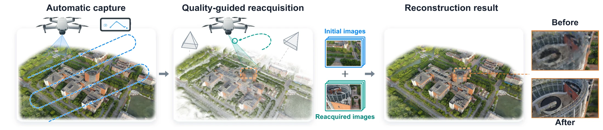
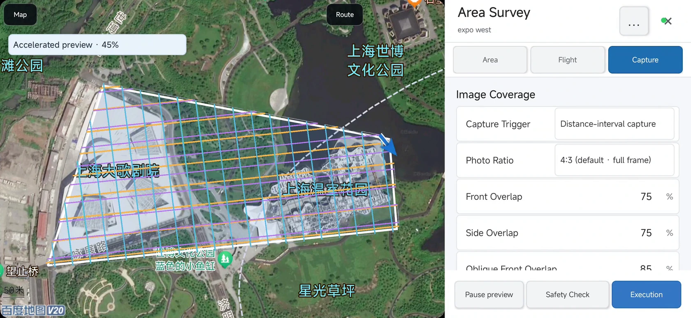

# OpenFlyScan

[**Paper**](https://arxiv.org/abs/2609.24253) · [Project page](https://openflyscan.github.io/) · [Citation](#citation)

**OpenFlyScan: A Quality-Guided Aerial Reconstruction System for Consumer Drones**

Zhongrui You, Zhen Li, Junli Liu, Zhigang Wang, Bin Zhao · arXiv, 2026



*Automatic capture → quality-guided reacquisition → improved Gaussian reconstruction.*

OpenFlyScan connects mobile aerial capture, early regional GS quality prediction,
targeted reacquisition, and reconstructed scenes for drone simulation. This is the
main project entry point and the home of the workstation service and Quality
Predictor training and evaluation code. Mobile clients and UE/HIL remain separate projects.

> Start here: [Quick start](docs/quickstart.md) · [Mobile apps](docs/apps.md) · [Workstation setup](docs/workstation.md) ·
> [HIL simulator](docs/simulator.md) · [Quality Predictor](docs/quality_predictor.md)

## Project components

| Component | Purpose | Entry |
| --- | --- | --- |
| **Quality Predictor** | Feature inputs, network, training, checkpoint inference and evaluation | [Code guide](docs/quality_predictor.md) |
| **Workstation service** | Mobile uploads, Pi3X geometry, quality prediction and reacquisition missions | [Service guide](docs/workstation.md) |
| **Mobile apps** | Android V4/V5 and iOS capture applications | [App repositories](docs/apps.md) |
| **UE / HIL simulator** | GS scene rendering, PLY conversion and Android/DJI HIL | [Simulator](docs/simulator.md) |
| **GS scenes and simulator packages** | Large downloadable assets, separate from source Git | [HF dataset](https://huggingface.co/datasets/IPEC-COMMUNITY/openflyscan) |
| **Project website** | System overview and demonstrations | [OpenFlyScan](https://openflyscan.github.io/) |

The source repositories are public:
[main](https://github.com/mistletoe235/OpenFlyScan),
[Android V4](https://github.com/mistletoe235/OpenFlyGo-Android-V4),
[Android V5](https://github.com/mistletoe235/OpenFlyGo-Android-V5),
[iOS](https://github.com/mistletoe235/OpenFlyGo-iOS), and
[UE / HIL](https://github.com/mistletoe235/OpenFlyScan-UE).
The trained Quality Predictor checkpoint (5.05 MB) and a small real-feature example
are included here. The scene-inclusive Expo East Linux HIL package is available
from [Hugging Face](https://huggingface.co/datasets/IPEC-COMMUNITY/openflyscan).
See [release status](docs/release_readiness.md) for the current package and data scope.

## Download the apps



*Android V5: five-direction survey planning and accelerated route preview in Expo West.*

Signed Android installation packages are mirrored in the
[main project release](https://github.com/mistletoe235/OpenFlyScan/releases/tag/preview-20260922) and each app's release. The paired APKs are
byte-identical; use either location, not both. Android APKs are publicly downloadable;
iOS installation uses TestFlight invitations.

| Client | Installation package | App release | Reference aircraft |
| --- | --- | --- | --- |
| Android V4 | [OpenFlyGo-Android-V4-0.3.1.apk](https://github.com/mistletoe235/OpenFlyScan/releases/download/preview-20260922/OpenFlyGo-Android-V4-0.3.1.apk) | [v0.3.1-v4](https://github.com/mistletoe235/OpenFlyGo-Android-V4/releases/tag/v0.3.1-v4) | Mini 2 |
| Android V5 | [OpenFlyGo-Android-V5-0.1.1.apk](https://github.com/mistletoe235/OpenFlyScan/releases/download/preview-20260922/OpenFlyGo-Android-V5-0.1.1.apk) | [v0.1.1-v5](https://github.com/mistletoe235/OpenFlyGo-Android-V5/releases/tag/v0.1.1-v5) | Mini 4 Pro |
| iOS | TestFlight by invitation | [Access information](https://github.com/mistletoe235/OpenFlyGo-iOS/releases/tag/testflight-20260922) | Mini 2 |

Android requires a supported arm64 device running Android 7.0 or later. Download
the matching V4/V5 APK, allow installation from the browser/file manager if prompted,
and install it. V4 and V5 are different SDK product lines, not interchangeable
upgrades. Back up missions before updating; do not uninstall or erase app data to
work around a signature mismatch or downgrade. SDK-supported aircraft are not all
project-validated. See [client compatibility and setup](docs/apps.md).

The release includes `SHA256SUMS`, package/source metadata and third-party notices.
It contains survey/capture clients, not the private VLN/model-inference builds.
Configure your own reachable workstation URL and access code for cloud features;
no production workstation credentials are included. The large UE/Expo East runtime
remains in the [HF dataset](https://huggingface.co/datasets/IPEC-COMMUNITY/openflyscan/tree/main/HIL-simulator).

### iOS TestFlight

The iOS app is **not currently distributed on the App Store because of MFi-related
authorization requirements** for its DJI accessory connection. Request access in
the [TestFlight discussion](https://github.com/mistletoe235/OpenFlyScan/discussions/1)
with your phone model, iOS version and aircraft/controller. The maintainer sends
invitations when an eligible external-testing build is available; a request is
not an invitation, and no installable IPA is provided here.

Use the discussion for requests and follow-up; no separate contact email is
required. An invitation email is optional in the initial request. Comments are public,
so only include an email if you accept that visibility. Never post passwords or verification codes.

### App safety notes

> [!WARNING]
> **Before using the apps:** rehearse the complete route, capture, pause/resume and completion workflow in the built-in simulator before every real flight. If available, use UE HIL as an additional check; remove propellers and confirm DJI Simulator activation before bench control tests.
>
> Check building/tree/wire clearance, transit and return paths, altitude datum, positioning and control/video signals. Consumer drones do not all provide omnidirectional obstacle sensing: enable and verify available obstacle avoidance, keep safe clearance and **do not use Sport/S mode**.
>
> Exit simulation and restore the real camera before real flight. Keep the pilot ready to pause or take over, follow local flight rules, and keep V4/iOS foreground and connected. Downloading a route or passing simulation does not authorize flight or establish real-flight safety.


## Install

For a self-contained CPU check, start with the [quick start](docs/quickstart.md).
It runs the included trained head on an eight-region Expo West feature sample;
no additional model or scene download is needed.

For mobile capture → upload → point cloud → reviewed reacquisition, start with
the [workstation guide](docs/workstation.md) and [client guide](docs/apps.md).
An SSH connection from the phone is not required: clients use a reachable
HTTPS service URL and bearer access code.

| Client | Pinned DJI SDK / reference aircraft | Mission schemas | Upload and cloud results |
| --- | --- | --- | --- |
| Android V4 | MSDK 4.16.4 / Mini 2 | 1–14 | Survey-trigger frames, historical photos, PLY and missions |
| Android V5 | MSDK 5.18.0 / Mini 4 Pro | 1–14 | Same; experimental continuous recapture requires schema 14 and DJI KMZ |
| iOS | MSDK 4.16.2 / Mini 2 | 1–14 | New source builds add session creation, trigger frames / historical photos and explicit finalize; PLY and missions supported |

Reference aircraft are not a guarantee for every SDK-supported product or every
build. See [SDK support links and platform differences](docs/apps.md). iOS live
uploads are aspect-preserving downlink frames, not SD-card originals; historical
photos require original GPS and ASL metadata. Existing distributed builds must be
updated to gain newly added features.

Create a session, collect/upload compatible images, explicitly finalize, then
inspect the cloud point cloud and proposed mission. Current workstation exports
carry `safe_to_execute=false` and `flight_authorized=false`: generation/download
is **not flight authorization**. Review and existing camera/altitude/preflight
checks remain required; no automatic takeoff or mission execution is implied.

Use Python 3.10 or newer. For GPU training, install a CUDA-compatible PyTorch
build for your system, then run:

```bash
python -m pip install -e '.[test,server]'
python -m unittest discover -s tests -p 'test_*.py'
```

This installs the Quality Predictor, service and CPU-test dependencies. Image-to-feature
extraction additionally requires the pinned Pi3X/GeoFF3D environment and model
weights; see [data and dependencies](docs/data.md).

## Predict and evaluate

Run the included trained checkpoint and real-feature sample:

```bash
python scripts/predict_quality.py \
  --checkpoint weights/quality_predictor.pt \
  --inputs examples/quality_predictor/expo_west_sample_inputs.npz \
  --output outputs/scores.npy --device cpu
```

The output preserves input region order. Larger scores indicate larger predicted
normalized regional GS reconstruction error. Feature fields, checkpoint format and
the shared-region evaluation command are documented in [the predictor guide](docs/quality_predictor.md).

## Training

The repository includes the paper configuration, Base/Sparse supervision,
source-patch recovery, view auxiliary loss, distributed trainer and selected
original tests. The public API is `openflyscan.QualityPredictor`.

```bash
python scripts/train_quality_predictor.py \
  --plan /data/plan.json --config configs/quality_predictor.json \
  --output outputs/training-run --expected-world-size 1 --chunks-per-rank 2
```

Training starts directly from the repository with a prepared data plan and CUDA
dependencies. The [training guide](docs/training_data.md) covers data preparation,
single-/multi-GPU execution and checkpoint resume. The downloadable teacher/cache
bundle is still pending.

## Layout

```text
openflyscan/                     Public API and checkpoint inference
openflyscan/quality_predictor/   Model, feature assembly, teachers and losses
openflyscan/server/              Sessions, uploads, jobs and artifact delivery
openflyscan/reconstruction/      Pi3X geometry and preview point clouds
openflyscan/planning/            Quality-guided reacquisition planning
openflyscan/missions/            Mobile mission export and validation
scripts/        Training, inference and shared-region evaluation
configs/        Paper reference configuration and asset manifests
weights/        Released Quality Predictor checkpoint
examples/       Small real-feature inference sample and reference scores
tests/          CPU regression tests and inference checks
docs/           App/UE entry points, data requirements and source provenance
```

Mobile and UE projects stay in independent repositories rather than being copied
here. The released head and small inference sample are included; full training images/caches and backbone weights must be prepared separately.
HF currently provides the scene-inclusive Expo East simulator, not standalone
GS PLYs or a training bundle. See [release scope](docs/release.md) for current
availability and licensing.

See [naming and compatibility](docs/naming.md) for archived checkpoint identifiers.

## License

Original OpenFlyScan code, the released Quality Predictor head and the small
inference example use [Apache-2.0](LICENSE). Third-party components retain their
own terms. Official Pi3X backbone weights use CC BY-NC 4.0; the source license
does not grant unrestricted commercial use of those weights. See
[licensing scope](docs/licensing.md) and [third-party notices](THIRD_PARTY_NOTICES.md).

## Citation

If you use OpenFlyScan in your research, please cite our paper:

```bibtex
@misc{you2026openflyscanqualityguidedaerialreconstruction,
  title = {OpenFlyScan: A Quality-Guided Aerial Reconstruction System for Consumer Drones},
  author = {Zhongrui You and Zhen Li and Junli Liu and Zhigang Wang and Bin Zhao},
  year = {2026},
  eprint = {2609.24253},
  archivePrefix = {arXiv},
  primaryClass = {cs.RO},
  url = {https://arxiv.org/abs/2609.24253}
}
```
